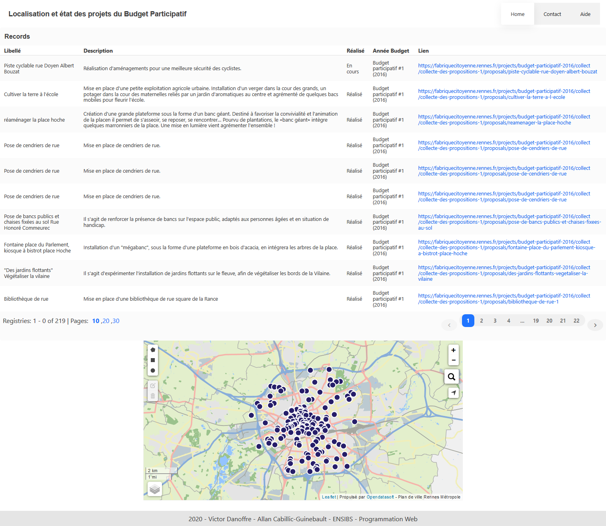
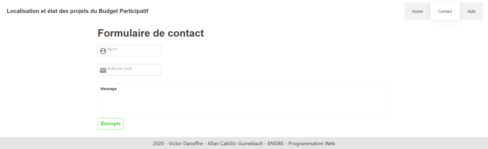
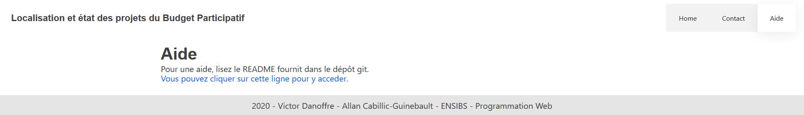

# Rapport projet Web

L'objectif de ce projet était de créer une application web avec pour objectif d'afficher des données récupérées via une API, et cela sous forme de tableau.

L'application devait également permettre le classement des données, et un valorisation de celles-ci.

Pour notre projet, le dataset était une liste de la localisation et de l'état des projets du Budget Participatif de la ville de Rennes. 

Notre application est responsive, on peut donc également l'utilisé sur téléphone ou tablette de façon optimale.

")

## Fonctionnalités

L'application permet de consulter les données sur la localisation et l'état des projets du Budget Participatif de la ville de Rennes.

Il est possible de trier les résultats par ordre alphabétique d'une colonne en cliquant sur celle-ci. 

L'application propose également une carte, qui permet de visualiser facilement dans quel quartier le projet a eu lieu. 

Il est possible d'accéder directement à un point spécifique sur la carte  en cliquant sur la ligne correspondante dans le tableau. Pour réinitialiser la carte avec tous les points, il suffit de double cliquer sur n'importe quelle ligne.

##  Arborescence des fichiers

La structure de fichier est une structure classique de projet VueJs. Elle est générée automatiquement grace à l'utilitaire VueJs-CLI.

D'abord, on a un répertoire src qui contient l'ensemble des sources du projet.

Ce répertoire est divisés en plusieurs autre répertoires. 

### App.vue

### Components
- VuesaxTable.vue
  - Code de ...   
  Ce code permet
- Navbar.vue
  - Code de ...   
  Ce code permet
- Footer.vue

### Pages
- Home.vue
- Aide.vue
- Contact.vue

")

")

